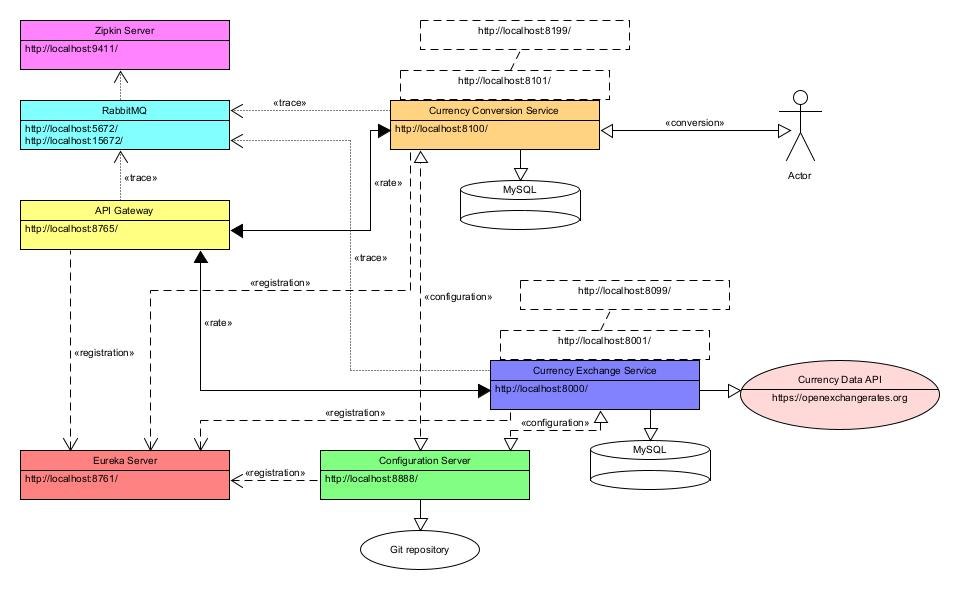

# Currency Conversion

A microservice based application providing currency conversion, 
based on the core concepts from the [Master Microservices with Spring Boot and Spring Cloud](https://www.udemy.com/course/microservices-with-spring-boot-and-spring-cloud/)
course on [Udemy](https://www.udemy.com/).

This is the main branch of the application. It utilises [Docker](https://www.docker.com/) to run the microservices. 
For the equivalent functionality for a [Kubernetes](https://kubernetes.io/) environment, please see the [kubernetes branch](https://github.com/ibuttimer/CurrencyConverter/tree/kubernetes).

# Table of Contents
1. [Services](#services)
    1. [Naming server](#naming-server)
    1. [Configuration server](#configuration-server)
    1. [API Gateway server](#api-gateway-server)
    1. [Currency Exchange Service](#currency-exchange-service)
    1. [Currency Conversion Service](#currency-conversion-service)
    1. [Tracing Service](#tracing-service)
1. [Architecture Diagram](#architecture-diagram)
1. [Setup and Build](#setup-and-build)
1. [Docker](#docker)
   1. [Build image](#build-image)
   1. [Run](#run)
      1. [Windows](#windows)
      1. [Service URLs](#service-urls)

## Services
### Naming server
A Netflix Eureka server providing a microservice registration and discovery service.
See [naming-server](naming-server/README.MD) for more details, and [dashboard](naming-server/README.MD#dashboard) for details of the Eureka dashboard in particular.

### Configuration server
A Spring Cloud Configuration Server providing support for externalized configuration, from a local git repository.
See [spring-cloud-config-server](spring-cloud-config-server/README.MD) for more details.

### API Gateway server
A Spring Cloud Gateway Server providing API routing.
See [api-gateway](api-gateway/README.MD) for more details.

### Currency Exchange Service
A microservice utilising [Open Exchange Rates](https://openexchangerates.org/) to provide a currency exchange rate service.
See [currency-exchange-service](currency-exchange-service/README.MD) for more details.

- [Actuator](http://localhost:8000/actuator)
- [OpenAPI Swagger UI](http://localhost:8000/swagger-ui.html)
- [Exchange rate example](currency-exchange-service/README.MD#get-exchange-rate)

### Currency Conversion Service
A microservice utilising the [Currency Exchange Service](#currency-exchange-service) to provide a currency conversion service.
See [currency-conversion-service](currency-conversion-service/README.MD) for more details.

- [Actuator](http://localhost:8100/actuator)
- [OpenAPI Swagger UI](http://localhost:8100/swagger-ui.html)
- [Currency conversion example](currency-conversion-service/README.MD#currency-conversion)

### Tracing Service
Distributed tracing is provided utilising [Spring Cloud Sleuth](https://spring.io/projects/spring-cloud-sleuth) with [Zipkin](https://hub.docker.com/r/openzipkin/zipkin) and [RabbitMQ](https://hub.docker.com/_/rabbitmq) Docker containers.

## Architecture Diagram

## Setup and Build
See the individual services for instructions:
- [Naming server](naming-server/README.MD#instructions)
- [Configuration server](spring-cloud-config-server/README.MD#instructions)
- [API Gateway server](api-gateway/README.MD#instructions)
- [Currency Exchange Service](currency-exchange-service/README.MD#instructions)
- [Currency Conversion Service](currency-conversion-service/README.MD#instructions)

## Docker
### Build image
See the individual services for instructions:
- [Naming server](naming-server/README.MD#docker)
- [Configuration server](spring-cloud-config-server/README.MD#docker)
- [API Gateway server](api-gateway/README.MD#docker)
- [Currency Exchange Service](currency-exchange-service/README.MD#docker)
- [Currency Conversion Service](currency-conversion-service/README.MD#docker)

### Run
#### Windows
To run all microservices: 
- Open Windows Powershell in the [docker](docker) folder.
- Ensure Docker Desktop is running
- Run `docker-compose up`

#### Service URLs

| Service | URL | Credentias |
|---------|-----|------------|
| Eureka | http://localhost:8761/ | - |
| RabbitMQ | http://localhost:15672/ | guest/guest |
| Zipkin | http://localhost:9411/ | - |
| Currency exchange | See [Get exchange rate](currency-exchange-service/README.MD#get-exchange-rate) | - |
| Currency conversion | See [Currency conversion](currency-conversion-service/README.MD#currency-conversion) | - |
